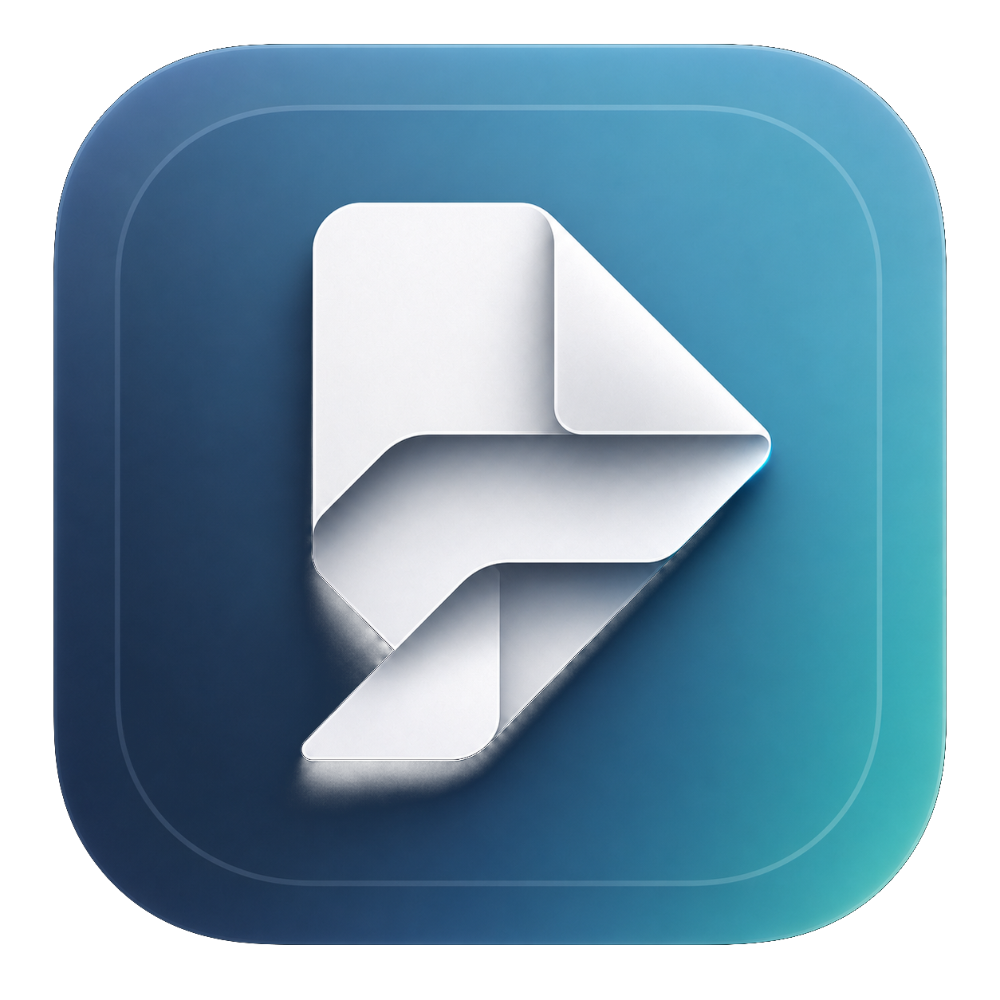

<p align="center">
  
</p>

<h1 align="center">📎 PDFold</h1>

<p align="center">
  
  
  
  
</p>

PDFold is a native macOS PDF workspace for combining, reading, annotating, signing, searching, and exporting multiple PDFs as one clean working document.

It is built for the moments when "just send me the PDF" becomes eight attachments, three revisions, one signature page, and a quiet need to remain employable.

## ✨ What It Does

- 📚 Combines multiple PDFs into a single reading workspace.
- 🧭 Adds generated section pages and a table of contents for sane navigation.
- 🖊️ Supports highlights, notes, ink, underline, strikeout, and signatures.
- 🔎 Searches across the full workspace.
- 🧩 Saves editable `.pdfoldproj` workspace packages.
- 📤 Exports a plain merged PDF or a PDFold bundle with embedded manifest data.
- 🖨️ Prints from the combined workspace view.
- 🔐 Handles password-protected PDFs through a native unlock prompt.

## 🚀 One-Step Mac Setup

For the easiest install:

1. Double-click [`scripts/install-mac.command`](scripts/install-mac.command).
2. Let the script build and install PDFold.
3. Open PDFold from the Desktop alias it creates.

The installer puts the app in `~/Applications/PDFold.app` and creates a Desktop alias named `PDFold`. No admin password, no ceremony, no "please clone seven package managers" side quest.

<details>
<summary>Prefer Terminal?</summary>

```zsh
./scripts/install-mac.sh
```

The terminal script performs the same install flow as the double-click version.
</details>

## 🧑‍💻 Requirements

- macOS 14 Sonoma or newer
- Xcode 15 or newer
- Swift 5.9

<details>
<summary>Why Xcode?</summary>

PDFold is a native SwiftUI document app. The setup script uses `xcodebuild` so it can produce a real `.app` bundle, copy it into your user Applications folder, and create a Desktop alias that behaves like a normal Mac app launcher.
</details>

## 🪄 Daily Workflow

1. Launch PDFold.
2. Drag one or more PDFs into the empty workspace.
3. Read, reorder, annotate, search, sign, rotate, or remove pages.
4. Save the workspace as `.pdfoldproj` when you want to keep editing later.
5. Export a merged PDF when you need to send the final document to someone who is not ready for your beautifully organized life.

## 🧰 Feature Map

| Area | Capabilities |
| --- | --- |
| Workspace | Multi-PDF import, document sidebar, generated section banners |
| Reading | Combined PDF canvas, table of contents, search |
| Markup | Highlight, note, ink, underline, strikeout |
| Signing | Signature placement using native PDF annotations |
| Pages | Move, rotate, delete, and rebuild workspace order |
| Export | Plain PDF, PDFold bundle, print |
| Persistence | Editable `.pdfoldproj` document packages |

## 📦 Project Structure

<details>
<summary>Show the technical layout</summary>

```text
PDFold/
  App/             App entry point and command wiring
  Document/        macOS document package read/write support
  Engine/          PDF loading, concatenation, manifests, bundle export
  Models/          Workspace, page, annotation, and signature models
  Resources/       App metadata, entitlements, and asset catalogs
  ViewModels/      Workspace state and document operations
  Views/           SwiftUI interface components
scripts/
  install-mac.command  Double-click Mac installer
  install-mac.sh       Terminal installer
```
</details>

## 🏗️ Development

Open the project in Xcode:

```zsh
open PDFold.xcodeproj
```

Build from the command line:

```zsh
xcodebuild -project PDFold.xcodeproj -scheme PDFold -configuration Debug build
```

<details>
<summary>Release build command used by the installer</summary>

```zsh
xcodebuild \
  -project PDFold.xcodeproj \
  -scheme PDFold \
  -configuration Release \
  -derivedDataPath .build/xcode \
  CODE_SIGNING_ALLOWED=NO \
  build
```

The installer strips macOS metadata from the built app, applies an ad-hoc local signature, verifies it, copies the app to `~/Applications`, and creates the Desktop alias.
</details>

## 🔒 Privacy & Security

PDFold is a local-first Mac app. Your documents are opened, edited, saved, and exported on your machine.

The app uses macOS sandboxing and file access through user-selected documents. In plain English: it handles the PDFs you give it, not your entire digital attic.

<details>
<summary>Sandbox details</summary>

The app enables:

- `com.apple.security.app-sandbox`
- `com.apple.security.files.user-selected.read-write`

These entitlements allow sandboxed read/write access to files selected by the user.
</details>

## 🧪 Testing Checklist

Before shipping a build, verify:

- Drag-and-drop import with multiple PDFs.
- Password-protected PDF unlock flow.
- Save and reopen of `.pdfoldproj` packages.
- Search results across combined documents.
- Annotation tools and undo behavior.
- Plain PDF export.
- PDFold bundle export.
- Desktop alias launch after running the Mac installer.

<details>
<summary>Suggested command-line smoke test</summary>

```zsh
xcodebuild -project PDFold.xcodeproj -scheme PDFold -configuration Debug build
```
</details>

## 🛣️ Roadmap

- Richer signature management.
- More export presets.
- Improved app icon artwork.
- Document thumbnails and faster page navigation.
- Automated UI smoke tests.

## 🤝 Contributing

Good contributions are focused, tested, and kind to the next person reading the code at 11:47 PM.

1. Create a focused branch.
2. Keep changes scoped.
3. Run a local build.
4. Include screenshots or notes for UI changes.
5. Open a pull request with the problem, approach, and verification steps.

## 🩺 Troubleshooting

<details>
<summary>The installer says Xcode is missing</summary>

Install Xcode from the Mac App Store, then open it once so macOS can finish setup. After that, run the installer again.
</details>

<details>
<summary>The Desktop alias does not open the app</summary>

Run the installer again. It refreshes `~/Applications/PDFold.app` and recreates the Desktop alias.
</details>

<details>
<summary>macOS warns the app is from an unidentified developer</summary>

This local development build is not notarized. Open it from Finder, then use **Open** from the security prompt. For distributed releases, sign and notarize the app with an Apple Developer account.
</details>

## 📄 License

PDFold is available under the [MIT License](LICENSE).
